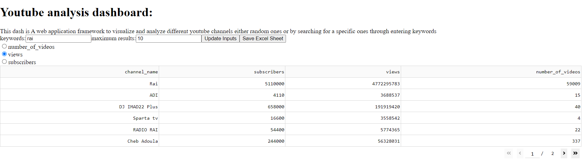
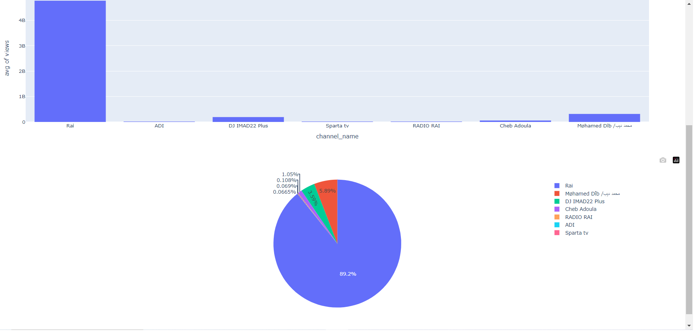

# YouTube Channels Statistics Dashboard



## Table of Contents

- [Introduction](#introduction)
- [Installation](#installation)
- [Usage](#usage)  
- [Search](#search)
- [Exporting Data](#exporting-data)
- [Contributing](#contributing)


## Introduction

The YouTube scraper is a simple Python tool that generates an interactive dashboard using the Plotly library. It allows users to visualize various (Views, Total videos and Number subscribers) statistics of YouTube channels based on the inputs (keywords, username ...)  provided by the user. The dashboard provides a comprehensive overview of the channel's performance and allows users to save the results as an Excel spreadsheet.

## Installation


   ```bash
   git clone https://github.com/tayebel/youtube_scraper.git
   cd youtube_scraper
   pip install  -r requirements.txt  
   ```
   
## Usage
Run the Python script:
```bash
 python run.py
 ```
Enter your YouTube Data API key.  
Open your web browser and visit http://localhost:8052 to access the dashboard.

NOTE: Before running the tool, make sure to get Your YouTube Data API key.  You can obtain one by following the instructions [here]([https://resinsight.org/getting-started/download-and-install/](https://developers.google.com/youtube/registering_an_application)).


## Search
To search for YouTube channels , follow these steps:  
Enter one or more inputs in the search bar provided.  
Click the "Search" button to initiate the search.  
The tool will retrieve the search results from YouTube and display them on the dashboard.  
You can also increase the number of results using maximumResults.

## Exporting Data
To export the displayed statistics as an Excel spreadsheet, click the "Save Excel Sheet" button located at the top-left corner of the dashboard.

## Contributing
Contributions to the YouTube Channel Statistics Dashboard are welcome! If you find any bugs or have suggestions for improvements, please open an issue on the GitHub repository. If you would like to contribute code, feel free to submit a pull request.

Please ensure that your contributions adhere to the coding conventions and include appropriate tests and documentation.

   
[](mailto:t.elmehadji@gmail.com)  [](https://www.linkedin.com/in/tayebelmehadji/)

 


 
